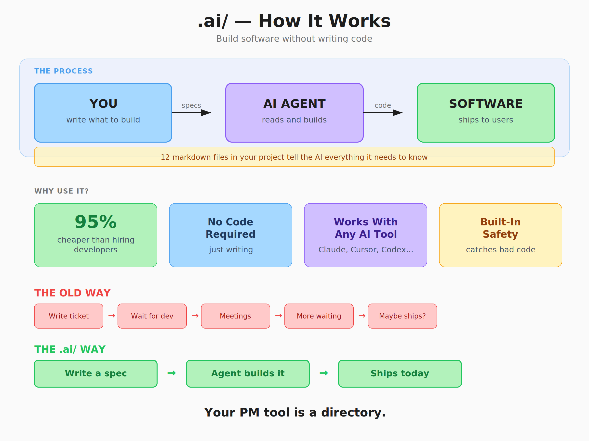
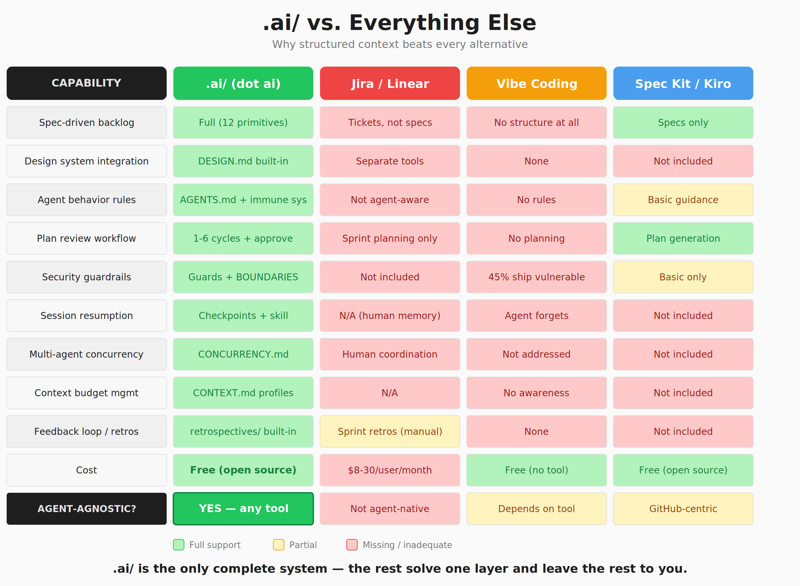
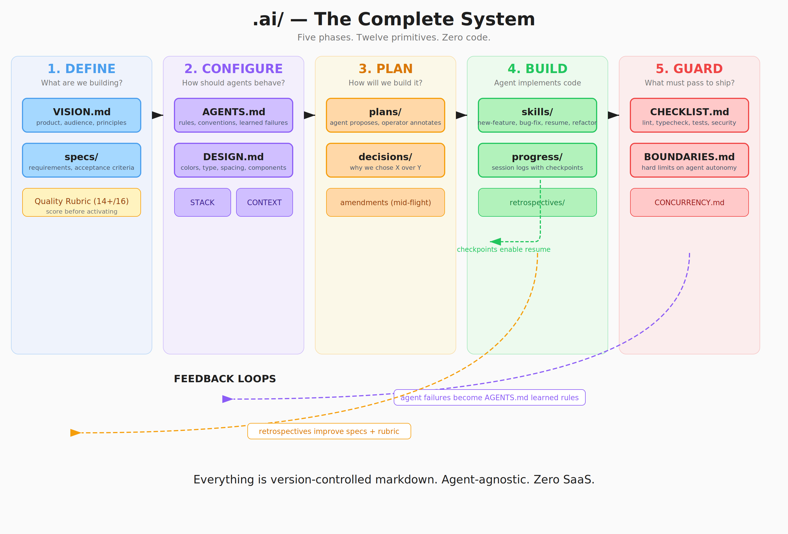

# .ai/ (dot ai)

**Your PM tool is a directory.**

In March 2026, Linear declared issue tracking dead. Google shipped DESIGN.md — a markdown file that replaces design handoffs. Anthropic formalized CLAUDE.md. OpenAI introduced AGENTS.md. GitHub published Spec Kit. Karpathy moved on from "vibe coding" to "agentic engineering." Every layer of the software development stack converged on the same pattern: **structured markdown files consumed by AI agents.**

Nobody assembled them into one system. Until now.

**.ai/ is a directory you add to any repo that replaces your project management tool entirely.** Twelve markdown primitives handle your backlog, sprint planning, design system, standups, QA checklists, onboarding docs, and deployment gates. No SaaS subscription. No ticket system. No ceremonies. Just version-controlled markdown that AI agents read natively and humans read easily.



---

## Why this exists

### The ticket was designed for a world that no longer exists

Jira was built in 2002. Trello in 2011. Linear in 2019. Every one of them encodes the same assumption: **software is built by humans who pick up small tasks from a queue.** The entire apparatus — sprints, story points, velocity tracking, standup meetings, backlog grooming — exists to coordinate people executing tickets.

That assumption broke. AI agents don't pick up tickets. They consume context. The unit of work isn't a two-sentence user story — it's a comprehensive specification document with acceptance criteria, architectural constraints, edge cases, and visual system references. The queue isn't a backlog of tasks — it's a directory of specs sorted by priority.

When your "developer" is an AI agent, the PM tool doesn't need to coordinate humans. It needs to **provide context to machines.** Markdown files in a git repo do that better than any SaaS tool ever will.

### The economics are irresistible

| Development model | Monthly cost | Annual cost |
|---|---|---|
| **.ai/ solo operator** (full AI-native stack) | **$200-500** | **$2,400-6,000** |
| Single US developer (fully loaded) | $12,500-20,000 | $150,000-240,000 |
| Small US dev team (2-3 engineers) | $33,000-50,000 | $400,000-600,000 |
| Offshore team (2-3 devs, Eastern Europe) | $15,000-28,000 | $180,000-336,000 |

A solo operator using .ai/ spends less per year than a traditional team spends per month. That's a **95-98% cost reduction.** The entire annual tool stack — AI coding tools, hosting, database, CI/CD, monitoring — costs less than two weeks of a single US developer's salary.

This isn't a marginal improvement. It's a structural shift in who can build software and at what cost.

### Real people are shipping real software this way

**Pieter Levels** built a multiplayer 3D flight simulator with zero game dev experience. Three-hour prototype, seven-day ship, $1M ARR by day 12. Single HTML file.

**Maor Shlomo** built Base44 alone with AI tools. 250,000 users, $189K/month revenue in six months. Wix acquired it for **$80 million** — one of the fastest solo-founder exits in SaaS history.

**63% of Lovable's users** have zero programming background. The platform hit $20M ARR in 60 days — the fastest-growing European startup ever.

**Rakuten** used Claude Code to navigate a 12.5 million-line codebase with 99.9% accuracy in 7 hours.

Solo-founded startups surged from 23.7% to **36.3%** of all new companies between 2019-2025. AI-native solopreneurs run businesses at 60-80% operating margins. This is the new normal.

---

## Why .ai/ and not something else



### vs. Jira / Linear / Trello / Asana

These tools coordinate humans. .ai/ provides context to agents. They charge $8-30/user/month and accumulate process overhead. .ai/ is free, lives in your repo, and gets version-controlled alongside your code. When Linear's CEO says "issue tracking is dead," he's describing the problem. .ai/ is the answer.

The deeper issue: SaaS PM tools create a **separation between your project management and your code.** Requirements live in Jira. Code lives in GitHub. The agent has to bridge that gap. With .ai/, requirements and code live in the same repo. The agent reads the spec from `.ai/specs/active/`, reads the plan from `.ai/plans/`, reads the rules from `.ai/AGENTS.md`, and starts building. Zero context switching. Zero tool integration. Zero handoff.

### vs. Vibe coding (no structure at all)

Vibe coding — prompting an AI with no structure and accepting whatever it produces — works for weekend prototypes. It does not work for production software. The data is clear: **45% of AI-generated code contains security vulnerabilities.** AI code has 2.74x more vulnerabilities than human-written code. 67% of developers spend more time debugging AI code than it saves them.

.ai/ exists because structure produces quality. The spec template forces you to enumerate edge cases. The quality rubric catches gaps before implementation. The plan review workflow catches architectural mistakes before code is written. The guard files catch security issues before code is merged. Vibe coding skips all of this — and ships the vulnerabilities along with the features.

### vs. GitHub Spec Kit / Amazon Kiro

GitHub's Spec Kit codified the spec-driven workflow: Specify → Plan → Tasks → Implement. Amazon's Kiro IDE built it natively. Both are excellent — and both are incomplete. They handle the spec-to-code pipeline but don't address the design system (DESIGN.md), the persistent project knowledge (AGENTS.md), the context budget management (CONTEXT.md), the quality gates (guards/), session continuity (checkpoints), multi-agent coordination (CONCURRENCY.md), or the feedback loop (retrospectives/).

.ai/ is the complete system. Spec Kit is one primitive within it.

### vs. Building your own workflow from scratch

You could design your own directory structure, write your own templates, and figure out your own conventions through trial and error. That's what practitioners like Boris Tane, Boris Cherny, and dozens of Claude Code power users did over the past year.

.ai/ is the distillation of what they learned. The spec template encodes the structure that produces specs agents can execute without follow-up questions. The skill files encode the workflows that prevent agents from skipping steps. The guard files encode the rules that catch the 45% of AI code that ships insecure. You can spend months discovering these patterns yourself, or you can `./setup.sh` and start with them.

---

## How it works



### The five-phase workflow

```
DEFINE ───→ CONFIGURE ───→ PLAN ───→ BUILD ───→ GUARD
  │             │            │          │          │
  ▼             ▼            ▼          ▼          ▼
Write       Set up       Agent      Agent      CI/CD +
specs     AGENTS.md    proposes    builds     operator
  +       DESIGN.md    operator    operator    verify
VISION      STACK.md   annotates   corrects
            CONTEXT    approves
```

**DEFINE:** Write a spec using the template. Score it against the quality rubric (need 14+/16 to activate). Move to `specs/active/`.

**CONFIGURE:** Maintain your context files — AGENTS.md (agent rules), DESIGN.md (visual system), STACK.md (tech choices). These compound over time. Every agent failure becomes a learned rule. Every design inconsistency becomes a DESIGN.md entry. The system gets smarter the more you use it.

**PLAN:** Tell the agent to read the spec and propose an implementation plan. Review it. Annotate it with corrections and business context. Repeat 1-6 times until the plan matches your intent. Mark it approved. **Never implement without an approved plan.**

**BUILD:** Agent implements the approved plan. You provide terse corrections ("wider," "wrong color," "use the empty state from DESIGN.md"). Monitor output. If things go fundamentally wrong, `git revert` and re-scope — don't patch.

**GUARD:** Automated CI/CD checks (lint, typecheck, tests, security scan) block bad code from merging. You verify the running application against the spec's acceptance criteria. Move the completed spec to `specs/completed/`.

### What you actually spend your time on

| Activity | Time | What you're doing |
|---|---|---|
| Writing and refining specs | 40% | Deciding what to build — your irreplaceable human judgment |
| Reviewing and annotating plans | 25% | Applying product thinking to technical decisions |
| Maintaining context files | 20% | Accumulating project knowledge that makes agents better |
| Visual verification and corrections | 10% | Testing the running app against acceptance criteria |
| CI/CD and guard setup | 5% | One-time configuration that runs automatically |

Zero percent writing code. Your entire value is in the quality of the context you provide and the judgment you apply during review.

---

## What's in the box

### The 12 primitives

| # | File | Replaces | Answers |
|---|------|----------|---------|
| 1 | `VISION.md` | Roadmap decks, strategy docs | What are we building and why? |
| 2 | `DESIGN.md` | Figma handoff, style guides, design tokens | What does it look like? |
| 3 | `AGENTS.md` | Onboarding docs, coding standards, tribal knowledge | How should agents behave? |
| 4 | `STACK.md` | Tech stack justification docs | What technologies and why? |
| 5 | `CONTEXT.md` | *(no traditional equivalent)* | How much context to load per task? |
| 6 | `specs/` | Jira tickets, Linear issues, user stories, PRDs | What exactly needs to be built? |
| 7 | `plans/` | Sprint planning, task breakdowns | How will we implement it? |
| 8 | `decisions/` | Meeting notes, Slack threads, architecture docs | Why did we choose X over Y? |
| 9 | `skills/` | Process docs, runbooks, SOPs | What's the workflow for this work? |
| 10 | `progress/` | Standups, status updates, sprint reviews | What happened? |
| 11 | `retrospectives/` | Sprint retros, quarterly reviews | Is our system improving? |
| 12 | `guards/` | QA process, security review, deploy checklists | What must pass before shipping? |

### Agent-agnostic by design

.ai/ works with every major AI coding tool. The same `.ai/` directory is consumed by:

| Tool | How it connects |
|---|---|
| **Claude Code** | Reads `CLAUDE.md` → `.ai/AGENTS.md`. Hooks auto-enforce guards. Slash commands map to skills. |
| **Cursor** | Reads `.cursor/rules/*.mdc` → scoped rules per file type, referencing `.ai/`. |
| **OpenAI Codex** | Reads root `AGENTS.md` → `.ai/AGENTS.md`. Parallel sandboxed execution. |
| **GitHub Copilot** | Reads `.ai/` context files via workspace context. |
| **Windsurf** | Reads `.ai/AGENTS.md` via cascade context. |
| **Devin** | Reads `.ai/` as repository context for autonomous tasks. |

You're not locked into one tool. You're locked into one directory convention that every tool can read.

---

## Quick start

### Option A: One-command setup

Run inside any existing project:

```bash
curl -fsSL https://raw.githubusercontent.com/howdycarter/dot-ai/main/setup.sh | bash
```

Or clone and run locally:

```bash
git clone https://github.com/howdycarter/dot-ai.git
cd dot-ai
./setup.sh /path/to/your/project
```

### Option B: Manual setup

```bash
cp -r .ai/ /path/to/your/project/.ai/
cp -r .cursor/ /path/to/your/project/.cursor/
cp CLAUDE.md /path/to/your/project/CLAUDE.md
cp AGENTS.md /path/to/your/project/AGENTS.md
```

### After setup — just open your agent

You don't fill in the templates manually. The agent does it.

When you open Claude Code, Cursor, or Codex after running setup, the agent detects the fresh `.ai/` install automatically (it sees the `{Project Name}` placeholder in CLAUDE.md). It then follows the onboarding skill:

1. **Inspects your codebase** — reads package.json, directory structure, tsconfig, tailwind config, CI pipeline, git history. Extracts framework, dependencies, build commands, design tokens, coding conventions, and commit style.
2. **Shows you what it found** — presents a summary of everything it detected and asks you to confirm or correct.
3. **Asks 3-6 questions** — only what it couldn't determine from the code. Product vision, design feel, absolute rules, technology exclusions. All questions in one message, not dripped one at a time.
4. **Populates every `.ai/` file** — VISION.md, DESIGN.md, AGENTS.md, STACK.md, CONTEXT.md, CLAUDE.md, Cursor rules, guard checklists — all generated from your codebase + your answers.
5. **Presents the results for review** — you review and correct. You're in control. You didn't have to author 12 files from scratch.
6. **Helps you write your first spec** — "What's the first feature you want to build?" It drafts the spec, scores it against the quality rubric, and gets you into the build loop.

For greenfield projects (no code yet), the agent skips codebase inspection and asks all six questions. It generates sensible defaults and tells you what assumptions it made.

**The entire onboarding takes one conversation.** You go from `./setup.sh` to an active spec ready for implementation in under 15 minutes.

---

## Key concepts

### Context engineering > prompt engineering

Tobi Lütke (Shopify CEO) named it: *"The art of providing all the context for the task to be plausibly solvable by the LLM."* Andrej Karpathy elaborated: *"The delicate art and science of filling the context window with just the right information."* Anthropic published the formal framework.

Prompt engineering is writing a sentence. Context engineering is designing a curriculum. .ai/ is that curriculum — structured as a directory of files the agent reads before every session.

### The spec is the new ticket

A ticket says "Add pagination to the users endpoint." A spec says exactly what pagination looks like, how it handles edge cases (empty results, single page, last page), what the loading and error states look like, which DESIGN.md patterns to use, what the acceptance criteria are, and what's explicitly out of scope.

Tickets assume a human will fill the gaps with judgment. Specs assume the agent needs everything upfront. The quality of your spec determines the quality of your software.

### AGENTS.md is the project's immune system

Every time an agent makes a mistake — uses floating point for currency, disables a security policy to fix an error, forgets a loading state — you add a rule to AGENTS.md preventing it from happening again. The rules are dated, specific, and append-only. Over time, the file accumulates the project's institutional knowledge. New agent sessions read it and avoid every past mistake automatically.

### Plan-then-execute is non-negotiable

The single highest-leverage practice: make the agent produce an implementation plan, review it, annotate it, and approve it **before any code is written.** Practitioners who use plan-then-execute workflows produce code with 40-60% fewer reverts. The plan review is where your product thinking becomes technical direction.

### Session checkpoints solve agent amnesia

Agents forget between sessions. Progress files include a CHECKPOINT block — a structured summary of what's done, what's next, which branch to check out, and what decisions were made. The `resume-session` skill reads the checkpoint and picks up exactly where the last session left off. No re-reading everything. No redoing work.

---

## Who this is for

**.ai/ is for anyone who builds software by providing context rather than writing code.**

- **Founders** shipping products without a development team
- **Product managers** who can now build what they spec
- **Designers** who think in systems and want to ship, not hand off
- **"Members of Technical Staff"** — the emerging generalist role where your value is context quality, not code output
- **Technical leaders** transitioning teams from ticket-based to context-driven development

You don't need to be an engineer. You need to think in systems, write precise specifications, and apply judgment during review. If you can write a product requirements document, you can use .ai/ to ship production software.

---

## The convergence that made this possible

Everything happened in the same two-week window in March 2026:

- **Linear** (March 24): CEO publishes "Issue tracking is dead," launches Linear Agent
- **Google Stitch** (March 19): Ships DESIGN.md — agent-readable design systems
- **Figma** (March 24): Launches AI agents on the canvas via MCP
- **Anthropic** (February): Ships Claude Code Agent Teams — multi-agent coordination
- **OpenAI**: Formalizes AGENTS.md for Codex
- **GitHub**: Publishes Spec Kit — spec-driven development toolkit

Every major platform independently arrived at the same conclusion: **structured markdown files are the interface between humans and AI agents.** .ai/ is the unified system that connects all of them.

---

## Scaling: solo to team

**.ai/ starts as a solo workflow and scales to teams without changing the system.**

**Solo operator:** One person owns all files. Parallel agent sessions on different specs. All review in your loop. The `.ai/` system externalizes the discipline that would otherwise require multiple specialized humans.

**Micro-team (2-5):** AGENTS.md and DESIGN.md become shared standards (PRs required to modify). Each person owns specs in their domain. Git branching per agent session. CONCURRENCY.md governs parallel work. Progress files replace standups.

**Growth team (5+):** Dedicated roles emerge — spec authors (product), architecture reviewers (tech lead), guard maintainers (platform). Skills library becomes institutional knowledge. Decision records prevent repeated debates. Monthly retrospectives drive continuous improvement.

---

## Full guide

The complete 10,000-word methodology — with filled-in examples for every primitive — lives at [`docs/GUIDE.md`](docs/GUIDE.md) or [howdycarter.com/dot-ai](https://howdycarter.com/dot-ai). It walks through each primitive with production-quality examples showing what real `.ai/` files look like: a VISION.md with principles that guide agent micro-decisions, a DESIGN.md with a full visual system, an AGENTS.md with learned rules from actual failures, a complete spec with GIVEN/WHEN/THEN criteria, an approved plan with operator annotations, and a progress file with a checkpoint for session resumption.

---

## Contributing

.ai/ is open source under the MIT license. Contributions welcome — especially new skill files, guard configurations for additional CI/CD platforms, and `.cursor/rules/` templates for popular frameworks.

---

## License

MIT — use it however you want, for any purpose.

---

*Created by [Christopher Carter](https://howdycarter.com) · VP Product Manager, AI at JPMorgan Chase*

*The ticket is dead. The spec is alive. The context engineer is the new builder. And `.ai/` is their workspace.*
